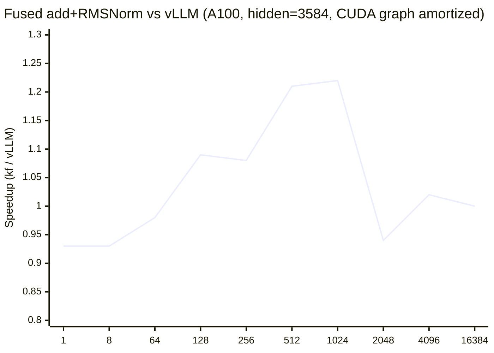
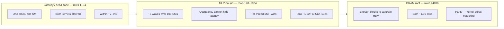

# KernelFuse

Hand-written CUDA for LLM inference norms, wired into production serving stacks, measured against stock kernels and full engines on A100.

The project has two layers that share one goal: **show where a fused norm kernel can and cannot matter**, with numbers that survive a skeptical read.

1. **Kernel layer** — fused residual-add + RMSNorm in bf16, register-resident, 16-byte vector loads that survive codegen (`LDG.E.128`).
2. **Serving layer** — HTTP harness across vLLM / SGLang / TensorRT-LLM, plus drop-in replacement of the fused norm op inside vLLM and SGLang.

---

## Results at a glance



| Finding | Number |
|---------|--------|
| Peak kernel win vs stock vLLM | **~1.22×** at rows 512–1024 |
| DRAM roof (rows=16384) | **Parity** — both ~**1.66 TB/s** |
| Batch-1 decode e2e (vLLM, Qwen2.5-7B) | **Null** — TPOT unchanged |
| SGLang e2e swap | **~1.4%** sys-throughput regression (4/4 cells) |
| Multi-engine decode (A100 80GB) | **SGLang** fastest batch-1 TPOT (~9.9 ms vs vLLM ~11.2 ms) |

---

## What we built

| Piece | Location |
|-------|----------|
| Standalone RMSNorm variants (naive → fused → smem → vec4) | `kernels/rmsnorm/` |
| Production op: fused add + RMSNorm (bf16, in-place residual) | `kernelfuse/` + `setup.py` |
| Correctness harness (CPU golden + extended shapes) | `tests/test_rmsnorm_correctness.py`, `tests/test_add_rmsnorm_correctness.py` |
| Serving HTTP harness (TTFT / TPOT / sys tok/s, identity checks) | `bench/` |
| vLLM / SGLang patch hooks | `scripts/phase8/patch_vllm_kernelfuse.py`, `scripts/phase8b/patch_sglang_kernelfuse.py` |
| Isolated CUDA-event microbench + rows sweep | `scripts/phase8/kernel_microbench.py` |
| Decode-attention ceiling microkernel | `kernels/attention/` |

### Kernel design (what actually mattered)

Two codegen traps dominated the story:

1. **Register demotion** — a local array indexed by a *runtime* variable cannot live in registers (registers are not addressable). nvcc silently spills it to local memory (= DRAM), recreating a two-pass global read. Fix: `#pragma unroll` over a compile-time `kVecPerThread` so indices are constant after unroll → **0 stack, 0 spills**.

2. **Vectorization that dies in SASS** — `struct { bf16[8] }` does not guarantee 16-byte transactions. Pre-fix SASS showed `LDG.E.U16`. Fix: explicit `uint4` load/store → **`LDG.E.128` / `STG.E.128`**.

Coalescing ≠ vectorization. Contiguous U16 loads across a warp still fill 128-byte sectors and can hit the DRAM roof. What `.128` buys is **per-thread memory-level parallelism** — visible when occupancy is too low to hide latency by itself.

---

## Kernel isolation vs vLLM

Hardware: Vast.ai **1× A100-SXM4-80GB**. Shape: hidden **3584**, bf16, CUDA-graph amortized launches. Baseline: vLLM `fused_add_rms_norm`.

### Full rows sweep

| rows | kernelfuse (µs) | vLLM (µs) | ratio |
|-----:|----------------:|----------:|------:|
| 1 | 3.70 | 3.42 | 0.93× |
| 8 | 3.79 | 3.54 | 0.93× |
| 64 | 4.10 | 4.02 | 0.98× |
| **128** | **4.64** | **5.03** | **1.09×** |
| **256** | **5.35** | **5.80** | **1.08×** |
| **512** | **6.70** | **8.12** | **1.21×** |
| **1024** | **11.79** | **14.40** | **1.22×** |
| 2048 | 28.42 | 26.56 | 0.94× |
| 4096 | 74.1 | 75.3 | 1.02× |
| 16384 | 282.7 | 284.0 | 1.00× |



**512 is not a spike.** The advantage is a smooth hump through 128→1024, then returns to parity. That band matches **vLLM chunked-prefill chunk sizes** (typically 512–2048 tokens) — the shape a real prefill hands the norm kernel.

### Roof arithmetic (rows=16384)

A correct fused add+RMSNorm moves four bf16 arrays (read input, read residual, write residual in-place, write output):

```text
4 × 16384 × 3584 × 2 ≈ 470 MB
470 MB / 283 µs ≈ 1.66 TB/s   (both kernels)
```

### SASS / dispatch note

An early dump of vLLM’s scalar fallback (`…BFloat16ELi0E…`) showed `LDG.E.U16`. Runtime dispatch selects the vectorized specialization when `hidden % 8 == 0` and pointers are 16-byte aligned (`…BFloat16ELi8E…` → `LDG.E.128`). **Both kernels vectorize** at this shape; roof parity is consistent. The mid-regime edge is residual inner-loop / MLP difference under partial occupancy — not “we vectorize and they don’t.”

### End-to-end (vLLM, Qwen2.5-7B, batch-1 decode)

| Cell | Baseline TPOT | Treatment TPOT |
|------|--------------:|---------------:|
| in=128 out=128 c=1 | 11.28 ms | 11.10 ms |
| in=128 out=512 c=1 | 11.25 ms | 11.21 ms |

**Null at serving level.** ~15 GB weights/token vs ~800 KB norm traffic/token; batch-1 decode never leaves the latency dead zone for this op. Greedy string outputs matched.

---

## SGLang integration

Same op patched over `sgl_kernel.fused_add_rmsnorm` (FlashInfer lineage — **not** the vLLM baseline).

| Cell | Baseline sys tok/s | Treatment | Δ |
|------|-------------------:|----------:|--:|
| in=128 out=128 c=1 | 99.7 | 98.3 | **−1.4%** |
| in=128 out=512 c=1 | 100.7 | 99.3 | **−1.4%** |
| in=128 out=128 c=64 | 3867 | 3803 | **−1.7%** |
| in=128 out=512 c=64 | 4591 | 4525 | **−1.4%** |

Consistent ~1.4% regression on 4/4 cells (directionally one-sided). Treatment binary was rebuilt against SGLang’s torch ABI with a host CUDA version-check bypass — caveat on all treatment numbers. Kernel isolation against `sgl_kernel` and an SGLang-local variance floor were not closed in that pass.

---

## Multi-engine serving (A100-SXM4-80GB)

Pre-registered matrix on **Qwen2.5-7B**, CUDA graphs on, harness identity closed to &lt;1 ms, **0 errors** across 156 cells.

| Engine | Install | Batch-1 TPOT (in=128) | Peak sys tok/s (in=128) |
|--------|---------|----------------------:|------------------------:|
| **SGLang 0.5.18** | pip | **~9.9 ms** | **~4.8k** |
| vLLM 0.8.5 + FA | pip | ~11.2 ms | ~4.0k |
| TRT-LLM 1.2.1 | pip serve | ~10.6 ms | ~3.2k |

Throughput knee for vLLM and SGLang at **c=64**. Batch-1 decode lands ~65–76% of HBM peak (~2039 GB/s on this SKU).

**TRT-LLM is not a matched peer** in this install: pip serve allocated ~3.5 GiB KV vs ~0.90×80 GB on the others. Quote vLLM vs SGLang for engine ranking; bracket TRT separately.

**TTFT caveat:** engine-default prefix caching + fixed cell order means later cells inherit warm prefixes. At `in=2048`, cold vs warm TTFT on the same prompt split ~109 ms vs ~21 ms. Do not treat TTFT as a clean cross-cell metric without an explicit cache policy.

---

## Standalone RMSNorm ladder (correctness → timing → why)

Progression under a shared CPU golden harness:

| Variant | Idea |
|---------|------|
| Naive | Two launches (reduce, then normalize) |
| Fused | One launch; still re-reads `x` from global |
| Fused + smem | Stage the row on-chip between passes |
| Fused + smem + vec4 | Vectorized loads; occupancy-sensitive at wide rows |

On mobile Turing / T4 profiling: occupancy-matched twins isolate **vectorization (MLP)**, not issue-bound behavior. Static shared memory (not napkin “dynamic only”) explains the 4096→8192 residency cliff (3 vs 1 blocks/SM).

---

## Decode-attention ceiling (stretch)

Naive decode attention vs a torch reference (CUDA events, A100):

| Backend | seq=512 | seq=2048 | scaling |
|---------|--------:|---------:|--------:|
| torch_ref | 104.7 µs | 106.2 µs | ~1.01× (overhead floor) |
| CUDA kernel | 177.1 µs | 562.8 µs | ~3.18× |

Correctness compares **fp32** outputs (bf16 bitwise match is expected and insensitive). Report `max_abs / max|ref|` and floored relative error; binding metric sits at ~72% of rtol (~1.4× headroom). Mutation near tolerance confirms the harness can fail.

---

## How to run

### Prerequisites

- Linux + NVIDIA GPU (sm_80+ recommended for the production op; Turing works for standalone RMSNorm)
- CUDA toolkit matching your PyTorch wheel
- Python ≥ 3.10
- For serving: enough VRAM for Qwen2.5-7B in bf16 (~16+ GB)

### 1. Clone and venv

```bash
git clone https://github.com/KashMaj1708/KernelFuse.git
cd KernelFuse
python -m venv .venv
source .venv/bin/activate          # Windows: .\.venv\Scripts\Activate.ps1
pip install -U pip
pip install torch --index-url https://download.pytorch.org/whl/cu124
pip install -e . --no-build-isolation
```

### 2. Standalone RMSNorm correctness

```bash
pip install numpy
python tests/test_rmsnorm_correctness.py
# or on Windows with the helper:
# .\scripts\run_rmsnorm_tests.ps1
```

### 3. Build / import the fused add+RMSNorm op

```bash
python -c "import kernelfuse; print(kernelfuse.fused_add_rms_norm)"
python tests/test_add_rmsnorm_correctness.py
```

If `nvcc` / torch CUDA disagree, you may need the same version-check bypass used on mismatched rentals (see `scripts/phase8/` rebuild helpers). Prefer matching toolkit and wheel.

### 4. Kernel microbench vs vLLM

```bash
pip install vllm==0.8.5   # pin to match reported numbers
# ensure LD_LIBRARY_PATH includes torch's lib/ if needed
python scripts/phase8/kernel_microbench.py --graph \
  --rows 1 8 64 128 256 512 1024 2048 4096 16384 \
  --out /tmp/kernel_rows_sweep.csv
```

### 5. Patch into vLLM (optional e2e)

```bash
export KERNELFUSE_FUSED_ADD_RMSNORM=1
python scripts/phase8/patch_vllm_kernelfuse.py   # inspect before applying
# start vLLM as usual; run bench/runner.py against the OpenAI-compatible endpoint
```

### 6. Serving harness (mock → real engines)

```bash
python tests/test_bench_metrics.py
python bench/runner.py --backends mock --limit-cells 4

# Real engines: start the server yourself, then point the harness at it.
# Matrices live under bench/config_matrix_*.yaml
python bench/runner.py --backends vllm_http --limit-cells 2
```

### 7. Decode-attention correctness (optional)

```bash
python scripts/phase9/decode_attn_correctness.py --out /tmp/decode_attn_f32.csv
```

### SASS check (no ncu required)

```bash
# Never dump an entire vLLM _C.so — resolve one mangled symbol first.
cuobjdump -symbols path/to/kernelfuse/_C*.so | grep fused_add
cuobjdump -fun '<mangled>' -sass path/to/kernelfuse/_C*.so | grep -E 'LDG|STG'
# Expect LDG.E.128 / STG.E.128 on the vector path.
```

---

## Project layout

```text
kernelfuse/          # installable fused add+RMSNorm extension
kernels/rmsnorm/     # standalone RMSNorm ladder (naive → vec4)
kernels/attention/   # decode-attention ceiling microkernel
bench/               # serving harness + config matrices
tests/               # correctness + harness unit tests
scripts/             # build, patch, microbench, profile helpers
notebooks/           # Colab / cloud helpers
docs/ENVIRONMENT.md  # machine / toolchain notes
```

---

## Limits (read before quoting)

- Mid-regime **~1.22×** is **kernel isolation**, not an e2e prefill claim (chunked-prefill A/B not re-run after the vectorization fix).
- Batch-1 decode e2e null is expected from traffic accounting.
- SGLang ~1.4% regression: n=1 per cell, CUDA version-check bypass on the treatment binary.
- Multi-engine TTFT needs an explicit cache on/off policy before cross-cell claims.
- ncu DRAM counters may be blocked on shared rentals; SASS + byte arithmetic closed the vectorization question here.

---

## License

See repository license file if present; otherwise all rights reserved by the author unless otherwise noted.
